#  Enclave API Server
> [!WARNING]
> The enclave project is still under heavy development and object to changes. This can include APIs, schemas, interfaces and more. Productive usage is therefore not recommended yet (as long as no stable version is released).

The API server provides secure endpoints for managing enclave resources and operations.

```mermaid
flowchart TD
    %% Spec & Codegen
    subgraph "Spec & Codegen"
        direction TB
        OpenAPI["openapi.yml"]:::speccolor
        CodegenServerCfg["oapi-codegen-server.yml"]:::speccolor
        CodegenClientCfg["oapi-codegen-client.yml"]:::speccolor
        OapiTargets["oapi.targets"]:::speccolor
        GenServer["api/gen.go"]:::speccolor
        GenClient["client/client.gen.go"]:::speccolor
    end

    %% Server Layer
    subgraph "Server (API Layer)"
        direction TB
        GenServer --> Impl["api/impl.go"]:::servercolor
        Impl --> RBAC["api/rbac.go"]:::servercolor
        Impl --> UsersAPI["api/users.go"]:::servercolor
    end

    %% Client SDK
    subgraph "Client SDK"
        direction TB
        GenClient
    end

    %% Configuration & Startup
    subgraph "Configuration & Startup"
        direction TB
        Config["config/config.go"]:::configcolor
        Main["main.go"]:::configcolor
        Main --> Config
    end

    %% ORM / Persistence
    subgraph "ORM / Persistence"
        direction TB
        ORMInit["orm/init.go"]:::ormcolor
        Model["orm/model.go"]:::ormcolor
        AuthDAO["orm/auth.go"]:::ormcolor
        UsersDAO["orm/users.go"]:::ormcolor
        ORMErr["orm/errors.go"]:::ormcolor
        ORMInit --> Model
        Model --> AuthDAO
        Model --> UsersDAO
        AuthDAO --> ORMErr
        UsersDAO --> ORMErr
    end

    %% Database
    DB[(Database)]:::dbcolor

    %% HTTP Flow
    ExternalClient{{"HTTP Client"}}:::externalcolor
    ExternalClient -->|HTTP request| Router["HTTP Router"]:::servercolor
    Router --> Impl
    Impl -->|"RBAC check"| RBAC
    RBAC --> AuthDAO
    RBAC --> UsersDAO
    AuthDAO --> DB
    UsersDAO --> DB
    DB -->|"data"| Impl
    Impl -->|"HTTP response"| ExternalClient

    %% Startup Flow
    Main -->|"init DB"| ORMInit
    Main -->|"setup router"| Router

    %% Spec & codegen flow
    OpenAPI -->|defines API| CodegenServerCfg
    OpenAPI -->|defines API| CodegenClientCfg
    CodegenServerCfg -->|generates| GenServer
    CodegenClientCfg -->|generates| GenClient
    OapiTargets -->|Makefile| GenServer
    OapiTargets -->|Makefile| GenClient

    %% Client usage
    DevApp["Client Application"]:::clientcolor
    DevApp -->|uses SDK| GenClient

    %% Dev/Ops Tooling
    subgraph "Dev/Ops Tooling"
        direction TB
        DockerfileNode["Dockerfile"]:::devopscolor
        Compose["docker-compose.test.yml"]:::devopscolor
        IntegrationTest["integration_test.go"]:::devopscolor
        MakefileNode["Makefile"]:::devopscolor
        Tools["tools.go"]:::devopscolor
        CI1[".github/workflows/ci.yml"]:::devopscolor
        CI2[".github/workflows/promote-image.yml"]:::devopscolor
        CI3[".github/workflows/release.yml"]:::devopscolor
        CI4[".github/workflows/sync-oapi.yml"]:::devopscolor
        CI5[".github/workflows/testing.yml"]:::devopscolor
        FlakeNix["flake.nix"]:::devopscolor
        FlakeLock["flake.lock"]:::devopscolor
    end

    %% Click Events
    click OpenAPI "https://github.com/enclaverunner/api-server/blob/main/openapi.yml"
    click CodegenServerCfg "https://github.com/enclaverunner/api-server/blob/main/oapi-codegen-server.yml"
    click CodegenClientCfg "https://github.com/enclaverunner/api-server/blob/main/oapi-codegen-client.yml"
    click OapiTargets "https://github.com/enclaverunner/api-server/blob/main/oapi.targets"
    click GenServer "https://github.com/enclaverunner/api-server/blob/main/api/gen.go"
    click GenClient "https://github.com/enclaverunner/api-server/blob/main/client/client.gen.go"
    click Impl "https://github.com/enclaverunner/api-server/blob/main/api/impl.go"
    click RBAC "https://github.com/enclaverunner/api-server/blob/main/api/rbac.go"
    click UsersAPI "https://github.com/enclaverunner/api-server/blob/main/api/users.go"
    click ORMInit "https://github.com/enclaverunner/api-server/blob/main/orm/init.go"
    click Model "https://github.com/enclaverunner/api-server/blob/main/orm/model.go"
    click AuthDAO "https://github.com/enclaverunner/api-server/blob/main/orm/auth.go"
    click UsersDAO "https://github.com/enclaverunner/api-server/blob/main/orm/users.go"
    click ORMErr "https://github.com/enclaverunner/api-server/blob/main/orm/errors.go"
    click Config "https://github.com/enclaverunner/api-server/blob/main/config/config.go"
    click Main "https://github.com/enclaverunner/api-server/blob/main/main.go"
    click DockerfileNode "https://github.com/enclaverunner/api-server/tree/main/Dockerfile"
    click Compose "https://github.com/enclaverunner/api-server/blob/main/docker-compose.test.yml"
    click IntegrationTest "https://github.com/enclaverunner/api-server/blob/main/integration_test.go"
    click MakefileNode "https://github.com/enclaverunner/api-server/tree/main/Makefile"
    click Tools "https://github.com/enclaverunner/api-server/blob/main/tools.go"
    click CI1 "https://github.com/enclaverunner/api-server/blob/main/.github/workflows/ci.yml"
    click CI2 "https://github.com/enclaverunner/api-server/blob/main/.github/workflows/promote-image.yml"
    click CI3 "https://github.com/enclaverunner/api-server/blob/main/.github/workflows/release.yml"
    click CI4 "https://github.com/enclaverunner/api-server/blob/main/.github/workflows/sync-oapi.yml"
    click CI5 "https://github.com/enclaverunner/api-server/blob/main/.github/workflows/testing.yml"
    click FlakeNix "https://github.com/enclaverunner/api-server/blob/main/flake.nix"
    click FlakeLock "https://github.com/enclaverunner/api-server/blob/main/flake.lock"

    %% Styles
    classDef speccolor fill:#D0E8FF,stroke:#0366D6,color:#0366D6
    classDef servercolor fill:#E6FFFA,stroke:#2C7A7B,color:#2C7A7B
    classDef clientcolor fill:#FFF5E6,stroke:#DD6B20,color:#DD6B20
    classDef configcolor fill:#EBF4FF,stroke:#3182CE,color:#3182CE
    classDef ormcolor fill:#FEFCBF,stroke:#D69E2E,color:#D69E2E
    classDef dbcolor fill:#F7FAFC,stroke:#4A5568,color:#4A5568
    classDef devopscolor fill:#F5E6FF,stroke:#805AD5,color:#805AD5
    classDef externalcolor fill:#EDF2F7,stroke:#4A5568,color:#4A5568
```

